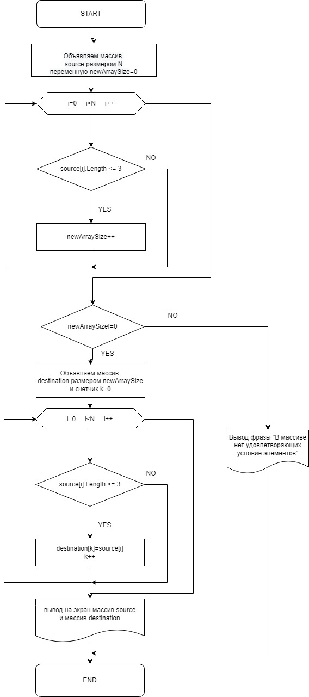

# Final_Project
## Задача: 
Написать программу, которая из имеющегося массива строк формирует новый массив из строк, длина которых меньше, либо равна 3 символам. Первоначальный массив можно ввести с клавиатуры, либо задать на старте выполнения алгоритма. 
При решении не рекомендуется пользоваться коллекциями, лучше обойтись исключительно массивами. 

### Примеры:
* [“Hello”, “2”, “world”, “:-)”] → [“2”, “:-)”]

* [“1234”, “1567”, “-2”, “computer science”] → [“-2”]

* [“Russia”, “Denmark”, “Kazan”] → []

## Решение:

Блок-схема прилагается 

Если использовать заранее заданный массив, то для создания второго массива с результатами, необходимо сделать первый цикл по всем элементам первого массива, чтобы узнать количество строк, длина которых меньше, либо равна 3 символам. Это счетчик newArraySize. 

При условии, что newArryaSize отличается от нуля, создаем второй массив с размером, равным счетчику newArraySize. И в новом цикле по каждому элементу первого массива переписываем нужные строки в новый массив, используя вспомогательную переменную k для второго массива.

Конечно, два цикла могут утяжелить программу, но это единственный способ создать второй массив нужного размера и помогает сэкономить память. Но если в экономии памяти мы не нуждаемся, то делаем второй массив такого же размера, как и первый и укладываем программу в один цикл.
